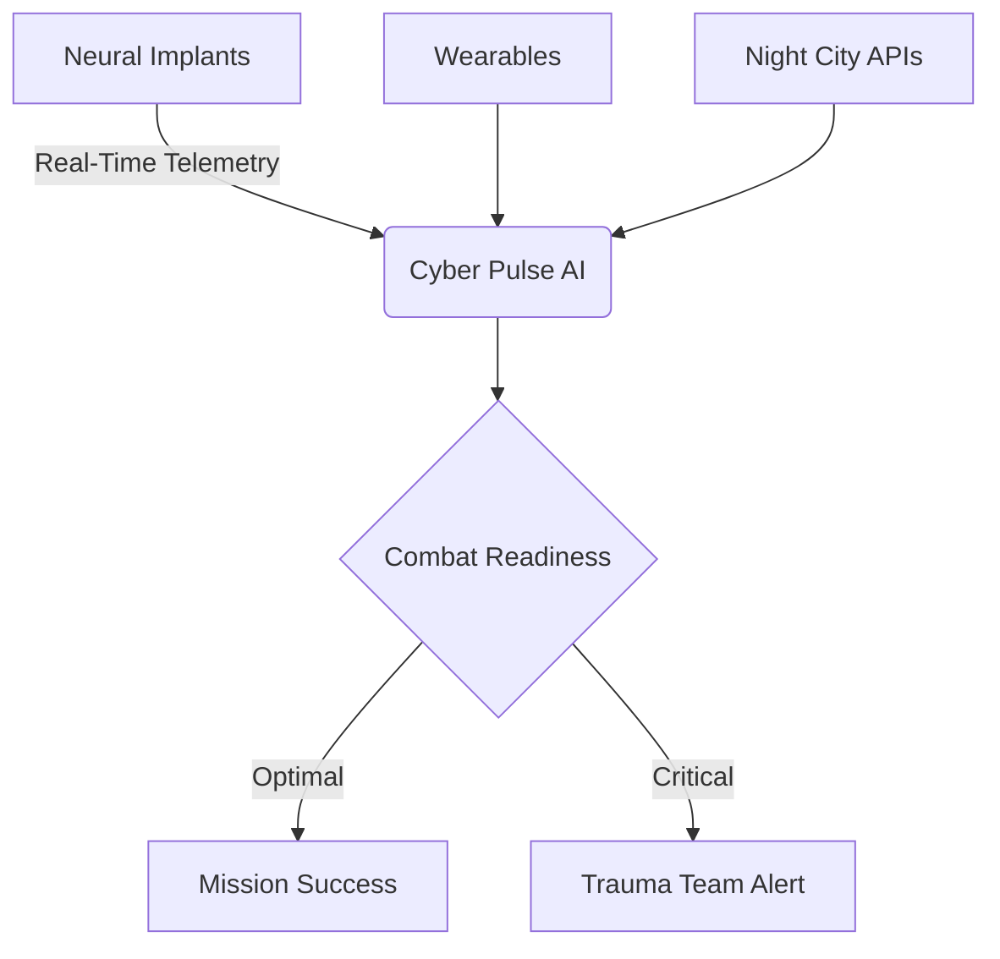
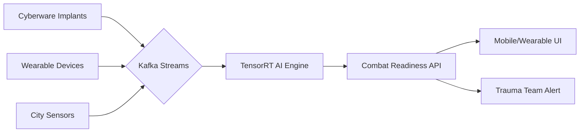
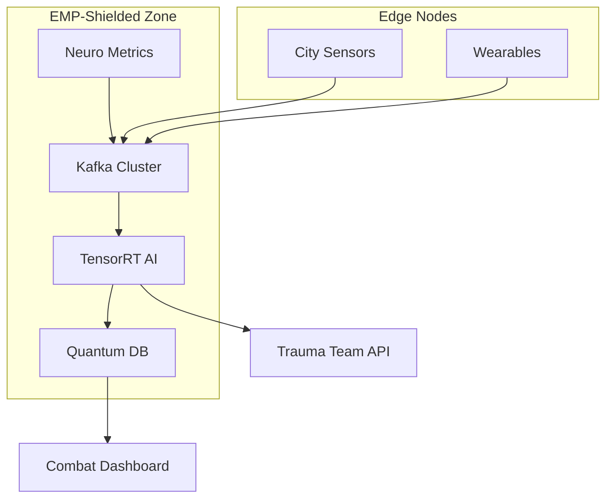

# Cyber Pulse - Combat-Ready Cyberware Optimization System

  
*Welcome to the mean streets of Night City*

## Overview
Cyber Pulse is a cutting-edge application designed for mercenaries navigating the dangerous world of cyber-enhanced humans and high-stakes missions. This system integrates physical training with cybernetic performance tracking, using military-grade AI to ensure peak combat readiness in the hostile environment of Night City.



## Key Features

### Combat Optimization
- 🧠 Neural feedback analysis
- 🔋 Cyberware stability monitoring
- ⚔️ Threat-based workout generation
- 🚨 System meltdown prediction

### Cyberpunk Integration
- 🗺️ Night City environmental adaptation
- 🕶️ Black market cyberware support
- 🚑 Trauma Team emergency dispatch
- 🧊 ICE (Intrusion Countermeasures)

### Performance Enhancement
- 🏋️ AI-driven workout routines
- 📊 EMP-hardened analytics
- 💪 Sandevistan optimization protocols
- 🧪 Experimental chrome support

## System Architecture



## Tech Stack

| Component | Technology |
|-----------|------------|
| **Frontend** | React Native, Three.js, ARCore/ARKit |
| **Backend** | Go, Rust, Python (Faust) |
| **AI/ML** | TensorRT, PyTorch, ONNX |
| **Database** | InfluxDB, PostgreSQL, MongoDB Atlas |
| **Streaming** | Kafka, Faust |
| **Infra** | Kubernetes, EMP-shielded Nodes |
| **Security** | Kyber-768, Neural Handshake Protocol |

## Getting Started

### Prerequisites
- Kubernetes cluster with EMP-hardened nodes
- NVIDIA GPUs with TensorRT support
- Quantum-resistant cryptographic hardware
- Night City API access (Level 4 clearance)

### Installation

1. **Clone the repo with neural authentication**
```bash
git clone https://github.com/night-city/cyberpulse.git --protocol neural
```

2. **Apply EMP-hardened infrastructure**
```bash
kubectl apply -f k8s/emp_shielding.yaml
```

3. **Deploy AI inference engine**
```bash
helm install neuro-engine ./charts/neuro-engine \
  --set shielding=gamma \
  --set combat.threatLevel=high
```

4. **Initialize quantum-secured database**
```bash
neuro-cli db init --encryption kyber-768 --shards 6
```

### Configuration
Create `config/gamma-secrets.env`:
```env
NEURAL_HANDSHAKE_KEY=base64:z0mG1n3R47ed_k3Y
TRAUMA_TEAM_API_KEY=tt_cc_7f8a3d
BLACK_MARKET_ACCESS_TOKEN=bm_9x45r
NIGHT_CITY_API_KEY=nc_v3_7s2h4j
```

## Usage

### Starting Neural Monitor
```go
package main

import (
  "cyberpulse/neuro"
  "cyberpulse/combat"
)

func main() {
  // Initialize with EMP protection
  monitor := neuro.NewMonitor(
    neuro.EMPShielding(true),
    neuro.ThreatLevel(combat.EXTREME),
  )
  
  // Start cortical interface
  if err := monitor.ConnectImplant(); err != nil {
    monitor.AlertTraumaTeam("NEURAL_DISCONNECT")
  }
  
  // Begin combat readiness assessment
  readiness := combat.AssessReadiness(
    monitor.GetNeuralMetrics(),
    monitor.GetCyberwareStatus(),
  )
  
  // Output to neural HUD
  neuro.ProjectToHUD(readiness)
}
```

### Running TensorRT Inference
```python
from cyberpulse.trt import NeuroEngine

# Load combat-optimized model
engine = NeuroEngine(
  model_path="models/sandy_mk5.trt",
  threat_profile="assault"
)

# Process real-time neural stream
while combat_status := engine.get_combat_feed():
  prediction = engine.infer(combat_status)
  
  if prediction.meltdown_risk > 0.85:
    engine.trigger_coolant_flush()
    engine.alert_trauma_team()
```

## Production Deployment

### EMP-Hardened Topology


### Deployment Commands
```bash
# Apply gamma-level shielding
neuroctl shielding enable --level gamma

# Deploy with combat readiness checks
helm upgrade cyberpulse ./charts/core \
  --set ai.replicas=6 \
  --set threatLevel=extreme \
  --set autoscaling.meltdownThreshold=85
```

## Contributing

### Cyberware Development Protocol
1. Submit neural handshake request via `neuroctl auth request`
2. Clone repository using cortical interface
3. Develop in EMP-shielded environment only
4. Submit pull request with combat-ready tests

### Testing Standards
```go
func TestMeltdownPrevention(t *testing.T) {
  // Create critical overload scenario
  scenario := neuro.NewScenario(neuro.OVERLOAD_CRITICAL)
  
  // Verify coolant flush initiates
  if !scenario.TriggerCoolant() {
    t.Error("COOLANT_FAILURE: System meltdown imminent")
    neuro.AlertNetrunnerTeam(t)
  }
  
  // Validate trauma team alert
  if !scenario.VerifyTraumaAlert() {
    t.Fatal("TRAUMA_DISPATCH_FAILED")
  }
}
```

## License
Distributed under the Night City Open License (NCOL). See `LICENSE.md` for details.

> **Warning** Unauthorized neural access violates Night City Penal Code §7-45. Offenders will be reported to MaxTac.

## Contact
- **Security Issues**: `secure@nightcity.nt`
- **Trauma Dispatch**: `911@traumateam.nc`
- **Black Market**: Contact Rogue at Afterlife

---

**Remember in Night City:**  
*"You don't make a name by being smart. You make a name by getting the job done."* - V
